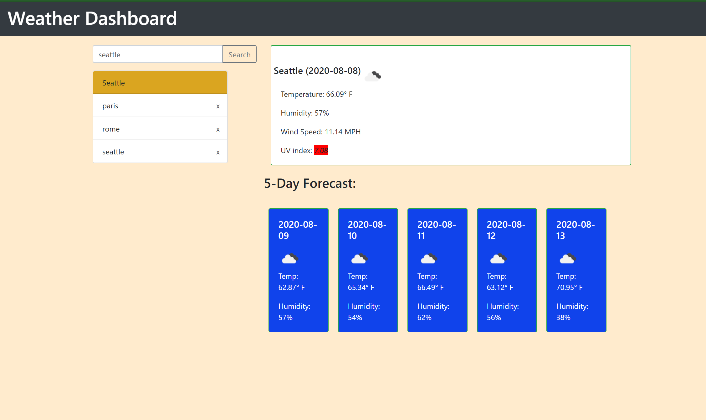

# [Weather-Chanel](https://valvarius.github.io/weather-Chanel/)
#### An application to retreive weather data for a city
> This project will get user's input of the city and then display the current weather as well as the 5 day forecast for that city. 

## Table of contents
* [Screenshots](#screenshots)
* [credits](#credits)
* [Setup](#setup)
* [Features](#features)
* [credits](#credits)
* [Contact](#contact)

## Screenshots

## Setup
To use this app you can click : [here](https://valvarius.github.io/weather-Chanel/)

## Features
* feature 1: 5 day weather forecast
* feature 2: currect weather data
* feature 3: ability to retrieve weather information of the previous searches

## credits
* Tech 1 - 5 day forecast, current weather and uv index API from: [openweathermap](https://openweathermap.org/)

<!-- * Tech 2 - Time from :[moments](https://momentjs.com/) -->

* Tech 2 - CSS styling used from:[bootstrap](https://getbootstrap.com/)

#### Contact
Email: notitiami@gmail.com

LinkedIn: [LinkedIn](https://www.linkedin.com/in/valerio-varani-635ba31a1/)

feel free to contact me!
